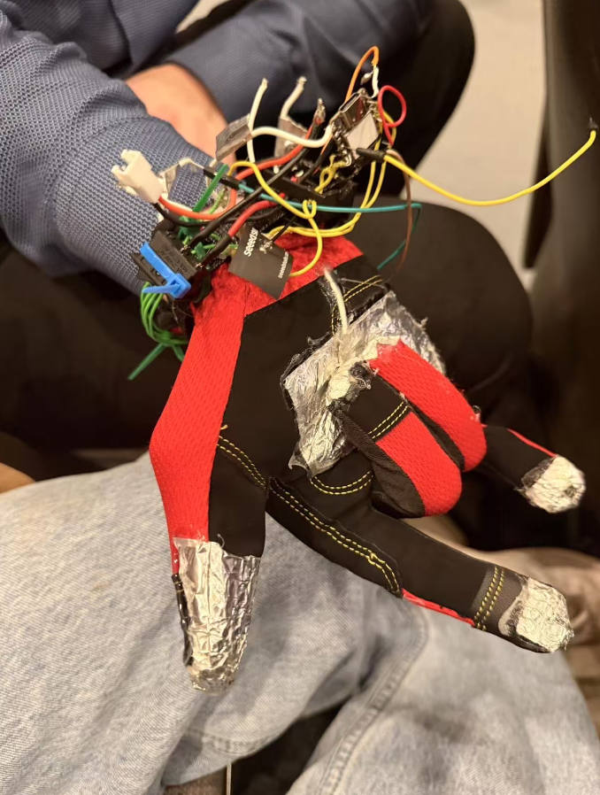

# 魔法手套 🪄 (XIAO ESP32-S3 蓝牙体感空鼠)

*[🇺🇸 Read in English](README.md)*

“魔法手套”是一款基于 Seeed Studio XIAO ESP32-S3 打造的可穿戴蓝牙 HID 设备。它结合了 MPU-6050 (GY-521) 陀螺仪，将你的手部姿态转变为全向空中鼠标与无线键盘。

## 核心特性 ✨
* **混合加速空鼠引擎**：摒弃传统的加速度计平移，采用陀螺仪角速度驱动。内置独家“线性+抛物线”双擎混合映射算法——慢速微操精准无比，快速甩腕瞬间响应跨屏。
* **双模式切换**：长按专用侧键，无缝在“体感鼠标模式 (Mode A)”与“打电动/纯键盘模式 (Mode B)”间切换。
* **零点瞬时抓取防抖**：每次按下体感触发键的毫秒间，底层算法会自动抓取当前姿态并抵消温漂底噪，无论何种姿势捏起手套，即刻顺滑拉取，绝不自飘。
* **极度稳定的 BLE 栈**：摒弃了默认极易崩溃的蓝牙库，从底层重构直接调用低功耗高并发的 `NimBLE` 协议栈，硬件级解决了多核心通讯下的丢包和“炸核 (Core 0 Panic)” 重启Bug。
* **听觉状态反馈**：自带外接 MH-FMD 低电平触发蜂鸣器逻辑，实现开机配对成功、模式无缝切换清脆入耳的声音反馈。

### 演示视频 🎥

<video src="gyroscope_demo.mp4" width="100%" controls></video>

## 针脚接线图 🔌
| ESP32-S3 针脚 | 连接模块 / 具体功能 |
| --- | --- |
| **SCL (I2C)** | 直连 `D5` |
| **SDA (I2C)** | 直连 `D4` |
| **D0**| [A 模式] 鼠标左键 / [B 模式] 键盘键位 'a' |
| **D1**| [A 模式] 鼠标右键 / [B 模式] 键盘键位 's' |
| **D2**| [A 模式] **长按激活体感鼠标** / [B 模式] 键盘键位 'k' |
| **D3**| 键盘键位 'l' (不随模式改变) |
| **D6**| 直连蜂鸣器 MH-FMD (I/O 信号脚) |
| **D10**| **长按 2 秒** 切换全局使用情景配置 |

## 使用步骤 🚀
1. 克隆 / 下载本项目到本地。
2. 确保将本项目自带的 `libraries/` 文件夹导入到你本地的 Arduino 库目录下（核心步骤：必须使用本工程中魔改定制抗崩溃的 `NimBLE_Combo_Keyboard_Mouse` 驱动库）。
3. 使用 Arduino IDE 打开并上传主程序 `glove/glove.ino` 到开发板。
4. 在电脑或手机上搜索蓝牙设备 "Magic Glove CCC" 并连接配对即可使用。
